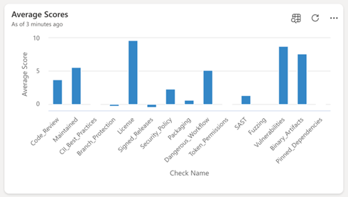
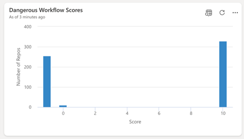
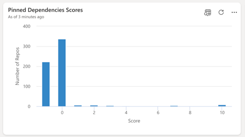
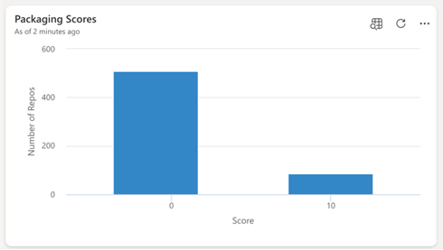

# Introduction
OpenSSF Scorecard is a tool developed by the Open Source Security Foundation (OpenSSF) that provides automated security assessments for open-source projects. The primary goal of the Scorecard project is to help developers and users determine the security posture of open-source software by generating a **score** based on a series of security-related checks. 

Using Scorecard, developers can assess the risks associated with each check and make informed decisions about accepting these risks, evaluating alternative solutions, or making improvements. 
Additionally, a company’s Open Source Program Office (OSPO) can utilize the tool at an organizational level to assess the scores of their owned repositories, as is the case with the Microsoft OSPO.

The image below illustrates the score of a Microsoft owned repository.

--- add image
 
# Content
This article is specifically aimed at .NET maintainers, showcasing how Scorecard and its recently introduced support for .NET can help enhance both the security and quality of the ecosystem. 

It explores the implications of this support, identifies gaps where maintainers can contribute to further improve Scorecard and shares insights from our research on the .NET open-source ecosystem, revealing several low-hanging fruits that maintainers should address to strengthen the security of their projects. 

We believe that by focusing on these areas, we, as .NET developers, can bring a significant enhancement to our community's security posture and contribute to a more secure open-source ecosystem.

# What is Scorecard and why should you use it
Scorecard has the following key features:
1.	Automated Security Checks: The tool performs a set of security-related checks on an open-source project, such as dependency management, continuous integration (CI) usage, security testing, and code review practices.
2.	Scoring System: Each project is evaluated against these security checks and receives a score (on a scale of 0 to 10) that reflects the overall security maturity of the project.
3.	Security Best Practices: The checks are based on security best practices for open-source development, such as the use of pinned dependencies, branch protection, code reviews, and fuzzing.
4.	Ease of Use: Developers and users can easily run Scorecard checks on their repositories via GitHub Actions, as well as view public scorecards for popular open-source projects.
5.	Community and Ecosystem Support: As part of OpenSSF’s initiatives, the Scorecard project helps improve the overall security of the open-source ecosystem by encouraging maintainers to adopt secure development practices.

Using the OSSF Scorecard for a project is important because it helps ensure that the open-source software you maintain follows essential security best practices. It can also be used to evaluate whether dependencies you take into your codebase meet your expected level of adherence to security practices. 

Today, Scorecard is recognized and utilized across various sectors of the software engineering industry. For instance, it is mentioned in the Cybersecurity and Infrastructure Security Agency (CISA) Tools and Resources (OpenSSF Scorecard | CISA). Moreover, Sonatype, who specialize in software supply chain automation and security, references its checks and recommends its adoption in their annual reports. Google’s Open Source Insights (deps.dev) project highlights the scorecard checks of each package shown.

Here’s why it matters:
### 1. Identifying Security Risks
Open-source projects are widely used across industries but can be vulnerable to security risks if not properly managed. Scorecard helps identify these risks by evaluating key security practices such as dependency management, code reviews, and CI workflows, enabling developers to take proactive steps to enhance security and prevent incidents like data breaches or system compromises.
### 2. Improving Software Quality
Scorecard checks promote good development practices, such as enforcing code reviews, updating dependencies, and using security tools like fuzzing and static analysis, which enhance both security and code quality. By identifying gaps in these areas, Scorecard helps teams prioritize improvements and manage technical debt effectively.

### 3. Building Trust with Users
Projects with a high security score on the OSSF Scorecard show users, contributors, and businesses that security is a priority, building trust and encouraging adoption as users are more likely to rely on software that is actively following secure development practices. For enterprises and government organizations, this trust is essential for integrating open-source software into their infrastructure.

### 4. Meeting Compliance Requirements
Many organizations have strict security and compliance requirements (e.g., SOC 2, ISO 27001) that mandate secure software development practices. Scorecard provides an objective evaluation of a project's security posture, helping maintainers meet these standards and making it easier for organizations to pass audits and regulatory checks.

### 5. Transparency in Security Posture
Open-source projects are often maintained by small teams or volunteers, making it difficult for users to assess their security. Scorecard provides transparency by generating an automated, easy-to-read security score that anyone can view, helping users and contributors make informed decisions about which projects to trust or support.

### 6. Encouraging Secure Best Practices
Scorecard encourages project maintainers to adopt secure practices like branch protection, regular security reviews, and integrating automated tools in CI/CD pipelines. By using Scorecard, teams can identify and improve weak areas, ensuring they consistently follow security best practices as their project evolves.

### 7. Preventing Supply Chain Attacks
A major concern in modern software development is the risk of supply chain attacks, where attackers compromise project dependencies or processes to inject malicious code. Scorecard assesses how effectively a project manages its dependencies, which is vital for preventing such attacks. Projects with strong scores in dependency management ensure that their dependencies are updated, verified, and secure, minimizing the risk of exploitation by malicious actors.

# What are the checks run by Scorecard 
The checks listed in the table below are automatically executed against a target project by default.

Name        | Description                               | Risk Level |
----------- | ----------------------------------------- | ---------- |
Binary-Artifacts | Is the project free of checked-in binaries? | High
Branch-Protection | Does the project use Branch Protection? | High
CI-Tests | Does the project run tests in CI, e.g. GitHub Actions, Prow? | Low
CII-Best-Practices | Has the project earned an OpenSSF (formerly CII) Best Practices Badge at the passing, silver, or gold level? | Low
Code-Review | Does the project practice code review before code is merged? | High
Contributors | Does the project have contributors from at least two different organizations? | Low
Dangerous-Workflow | Does the project avoid dangerous coding patterns in GitHub Action workflows? | Critical
Dependency-Update-Tool | Does the project use tools to help update its dependencies? | High
Fuzzing | Does the project use fuzzing tools, e.g. OSS-Fuzz, QuickCheck or fast-check? | Medium
License | Does the project declare a license? | Low
Maintained | Is the project at least 90 days old, and maintained? |	High
Pinned-Dependencies | Does the project declare and pin dependencies? | Medium
Packaging | Does the project build and publish official packages from CI/CD, e.g. GitHub Publishing | Medium
SAST | Does the project use static code analysis tools, e.g. CodeQL, LGTM (deprecated), SonarCloud? | Medium
Security-Policy | Does the project contain a security policy? | Medium
Signed-Releases | Does the project cryptographically sign releases? | High
Token-Permissions | Does the project declare GitHub workflow tokens as read only? | High
Vulnerabilities | Does the project have unfixed vulnerabilities? Uses the OSV service. | High
Webhooks | Does the webhook defined in the repository have a token configured to authenticate the origins of requests? | Critical

# What is supported for .NET/NuGet
For the past two years, Scorecard has started to implement dedicated support for projects within the .NET ecosystem, which use the NuGet package manager. The most recent features added are support for checking pinned dependencies when restoring packages using a lock file and when using Central Package Management.

## Running Scorecard on a NuGet package
You can run Scorecard with the repository name as the input (`--repo=[YOUR REPO NAME]`) or you can run it with the name of a NuGet package for one that is hosted on Nuget.org. To do that you need to specify the `--nuget` flag and provide the package name for which you want the corresponding GitHub source code to be checked.

For example: `--nuget=Newtonsoft.Json`

Note that this feature is only supported for packages that define the repository attribute in their  package metadata .nuspec file.

## Packaging 
This check evaluates whether the project is published as a package. Packages make it easier for users to download, install, update, and receive security patches via a package manager. The check currently looks for GitHub packaging workflows and language-specific GitHub Actions that upload the package to NuGet and other package managers. 

Note that if a project uses different packaging tools, it may still receive a low score, as Scorecard can't detect all packaging methods. A low score doesn’t necessarily mean the project is at risk. If your packaging method isn’t recognized, consider opening an issue with the Scorecard maintainers. 

In case your project receives a low score on this check, you can try the following remediation steps:

- Publish your project as a downloadable package, e.g., if hosted on GitHub, use GitHub's mechanisms for publishing a package.
- If hosted on GitHub, use a GitHub action to release your package to language-specific hubs.

## Pinned dependencies 
For restoring NuGet packages, it is considered best practice to use Central Package Management (CPM) and/or a lock file to fully lock down the package dependency graph, ensuring consistent and repeatable builds while preventing “it works on my machine" issues.

This Scorecard check aims to determine whether the project pins its dependencies during the build and release process. A "pinned dependency" refers to a dependency explicitly set to a specific hash, rather than allowing a mutable version or version range.

The check typically identifies unpinned dependencies in Dockerfiles, shell scripts, and GitHub workflows used in the build and release stages of the project. For .NET/NuGet, Scorecard detects potential risks when installing or restoring NuGet packages without using Central Package Management or without specifying the locked mode flag either in the restore command or via the `RestorePackagesWithLockFile` attribute in all the .csproj files. 

This makes sure the repository is either using the built-in security mechanism in nuget.org that cryptographically validates the dependencies you’re using (when using CPM), or that a lock file is used to do the same during build time.

### Examples:

The following CLI commands will be marked as a pinned dependency:

```
nuget restore -LockedMode
dotnet.exe restore --locked-mode
msbuild.exe /t:restore /p:RestoreLockedMode=true
```

The following commands will be marked as unpinned dependencies:

```
nuget restore
dotnet.exe restore
msbuild.exe /t:restore
```

Unless you either:
- set `ManagePackageVersionsCentrally` to true in the `directory.*.props` file AND add a specific version to all included packages
- set the` RestorePackagesWithLockFile` attribute to true in all .csproj files in the repository.

In case your project receives a low score on the pinned dependencies check, you can try the following remediation steps:

- If your project is producing an application, declare all your dependencies with specific versions in your package format file (e.g. packages.config for NuGet).
- If the package manager supports lock files (e.g. packages.lock.json  for NuGet), check these in the source code. The files maintain signatures for the entire dependency tree and prevent future exploitation in case the package is compromised.
- For Dockerfiles, pin dependencies by hash as in this example. If using a manifest list, pin to the manifest list hash instead.
- In GitHub workflows used in building and releasing your project, pin dependencies by hash. See main.yaml for example. To determine the permissions needed for your workflows and pin actions to commit SHAs, you may use StepSecurity's online tool.
- To update dependencies after pinning, use tools such as Dependabot and Renovate bot.

# An analysis of Scorecard checks for .NET open source repositories on GitHub

On GitHub, there are over 1,000 C# and F# repositories with more than 1,500 stars. Our team analyzed the Scorecard scores for these repositories using the public Scorecard API to get an ecosystem-wide view of the state of .NET open-source projects. 

The diagram below displays the average scores for all Scorecard checks for those repositories. Please note that scores below zero are not relevant and may indicate an error during the Scorecard check execution.



It’s especially noteworthy to look at the most critical security check, Dangerous Workflows. In this case, the check either receives a perfect score of 10 or identifies an error, which occurs in over 250 repositories. This reveals existing security gaps and highlights opportunities for improvement to strengthen overall security.


 
Moreover, the pinned dependency scores show a gap in support for the NuGet ecosystem that should be improved given the recent work that was done. As these features were newly released at the time this article was written, the change in score is still not visible. There is a similar gap in support for packaging that can be better addressed by Scorecard to further detect the NuGet ecosystem.




 
Other checks illustrated below, which are not tied to specific ecosystems and rely solely on GitHub APIs, highlight low-hanging fruit opportunities for .NET ecosystem maintainers to make improvements and enhance open-source security.
 
 ----add rest of the images

  
# Recommendations and action items
With the recent improvements in handling pinned dependencies and packaging checks for the NuGet package manager, the ability to assess the security features of GitHub repositories in the .NET ecosystem will be substantially enhanced. This should encourage repositories’ maintainers to adopt necessary improvements, leading to higher scores measured by Scorecard and improved overall security.

In conclusion, regularly running OSSF Scorecard checks helps ensure your project stays secure, up-to-date, and aligned with coding best practices. This proactive approach significantly reduces the risk of security vulnerabilities within your software ecosystem.

Don’t delay! Check the Scorecard of your favorite GitHub repository today and if you’d like to improve the score, take a look at the suggested mitigation steps 😊


# References (todo add more once we agree on a final version)
-	scorecard/docs/checks.md at main · ossf/scorecard (github.com)
-	How OSPOs Can Be a Key Lever for Open Source Sustainability and Security – Open Source Security Foundation (openssf.org)
-	9th-Annual-SSSC-Report.pdf (sonatype.com)
